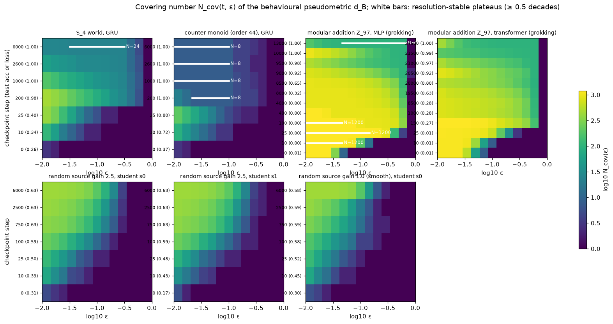

# origination — recovering the endogenous interface language of trained computational systems

**Active project statement.**  Recover the endogenous interface language of
arbitrary computational systems from behavioural substitution and
composition, without assuming their ontology in advance:

    trained substrate → behavioural interfaces/types → fits/interactions
                      → composition → higher-order interfaces
                      → an executable abstract description of the system

The formal target is in **`INTERFACE_LANGUAGE.md`**: an interface is an
equivalence class of internal pieces under substitution across a context
family (never a neuron, direction, cluster, probe or label); a fit
`(A₁…Aₙ) ⇝ B` is a reproducible interaction whose result is itself an
interface; higher-order interfaces are classes of interaction patterns by
the fits they induce; the deliverable is an executable model
`M = (𝓘, 𝓕, 𝓒, ε, residual)` judged by **counterfactual fidelity on a
held-out intervention suite against description complexity**, with
compositional generalisation on withheld combinations and causal
abstraction (`do(I = i)` through distinct realisations) as the decisive
tests.  Discovery and evaluation are separated in code: discovery
(`emergence/lang/discover.py`) sees pieces, interactions, behaviour and
unlabelled contexts only; evaluation (`emergence/lang/evaluate.py`) may
unseal known structure to *describe* the result, never to select it.

Code: `emergence/lang/` — `substrate.py` (what discovery may touch, with a
change-of-basis wrapper), `discover.py` (`discover_interfaces`,
`discover_fits`, `compose`, `extract`), `model.py` (the executable
`InterfaceModel`: `classify`, `run`, `spec`), `evaluate.py`
(`heldout_suite`, `predict_intervention`, `evaluate_fidelity`,
`measure_complexity`, random-abstraction and lookup baselines,
`causal_abstraction`, `basis_robustness`, `unseal`), `run.py`
(`extract` / `pareto` / `basis` / `report`).  Results: `results/lang/`.

Benchmark ladder (validation before the target): Level 0 known finite
structures on existing trained GRUs (S_4, reset monoid, counter monoid);
Level 1 distributed realisation under a change of basis; Level 2 multiple
valid decompositions; Level 3 one learned system with no privileged
ontology, judged only by fidelity, compositional generalisation,
compactness and reproducibility.  Level 3 is not attempted until Levels 0–2
pass.

**Milestone 1 results** (Level 0 and Level 1 on existing checkpoints) are
in the section "Milestone 1: interface-language extraction on existing GRU
world models" below.

---

## Historical groundwork: the emergence phase (closed)

Everything from here to the milestone section is the previous research
programme — emergent discreteness, grokking as crystallisation,
"clicking", the resolution-dependent quotient, the Boolean-circuit
negative and the backward-tracing final experiment (terminal conclusion C
in `CONCLUSIONS.md`).  It is retained as methodological groundwork and as
the control set for the new project: the extractors, the adversarial
controls, the label-free discovery machinery and the Lean layer
(`lean/Emergence/Interfaces.lean` formalises interfaces, multiway fits and
higher-order interfaces exactly as the new target uses them).  None of its
hypotheses organise future work: grokking, phase transitions, whether
mathematics "emerges", discrete vs continuous, finite vs infinite
quotients, compression as a causal theory, and groups/monoids as
privileged targets are all set aside as research targets.


## Status of the emergence phase (historical)

Everything below is organised into four kinds of result.  Only the third
kind bears on the generalised thesis; the first two are prerequisites.

**1. Known-structure recovery** — the task *contains* an algebra and the
question is whether the label-free extractor recovers it from a trained
substrate.  Modular addition (grokking; Z_97, Z_89, Z_101, Z_8×Z_8,
subtraction, scrambled presentations, corrupted tables); permutation,
reset and counter worlds (S_4, monoids of order 48 and 44) on a GRU;
the Langevin and continuous-ODE substrates (designed wells, double well,
random landscapes).  All recovered exactly where the substrate solved the
task.  These show the machinery works; they are not evidence for the
thesis, because the algebra was written down before training.

**2. Extractor and interface validation** — the extractor is not a template
matcher (adversarial tables), does not manufacture structure from a
random table or a memorising network, distinguishes compact from
distributed realisations (label-free interface search: the GRU's hidden
state is rediscovered as its minimal interface; the transformer that solves
the counter world has no compact interface), and reports absence of
structure where there is none (single well, random landscape funnel).

**3. The discovery test** (`emergence/grok/discover.py`, section "Discovery
experiment" below) — an ordinary sequence-prediction task with no planted
algebra: next-token prediction of sequences from a random recurrent source.
Outcome: trained students develop **predictive, interventionally real
behavioural types** (levels A–C below), reproducible across seeds only to
ARI ≈ 0.6–0.7 and resolution-dependent in number; the induced transitions
close at one resolution for the smoother source but the algebra they
generate differs from seed to seed; no nontrivial laws.  **No compact,
canonical internal algebra was found.**  The strong thesis is not supported
by this experiment; the weaker statement — learning produces substitutable,
predictive internal types that mirror the source's predictive structure —
is.

**5. The click experiment** (`emergence/click/`, section "The click
experiment" below) — the framing corrected to what the thesis actually
claims (stable interfaces → reproducible fits → composition → higher-order
interfaces; discreteness and finiteness are special cases, not the claim),
and one frozen experiment on a task with no planted decomposition (a
random layered Boolean circuit with reuse pressure) under a weight-decay
sweep.  Outcome: **no emergent compositional interface** — every learner
solves the task perfectly, but at no checkpoint, site or pressure level
does any direction carry a resolution-stable, context-general, sufficient
set of types; acceptances occur at the random-direction baseline rate.
Post-hoc labelled diagnostics show the generating gates are perfectly
linearly decodable at both sites yet their probe directions are not
interfaces either at the frozen pressure levels (the substrate is not
invariant to within-class variation along them); at a post-hoc stronger
level (weight decay 1.0) the gate directions do become resolution-stable
in half the cases — a real trend along the pressure axis, invisible to the
label-free dictionaries and still short of a sufficient, composable set.
A follow-up replaced the candidate dictionary with a label-free
**behavioural interface discovery** (Grassmannian search over subspaces of
rank 1–8 directly for the interface properties, disjoint discovery /
validation / final pools, shuffled-weight and matched-random controls) and
found **outcome 1: no interfaces even with behavioural search** — the
trained networks' best interface quality equals that of weight-shuffled
networks at every checkpoint and pressure level; the negative result is
about the learner, not the coordinates.  `lean/Emergence/Interfaces.lean`
fixes the exact meaning of interface, multiway fit, recursive generation
and higher-order interface.

**6. Final experiment and conclusions** (`emergence/trace/`, `CONCLUSIONS.md`) —
the final interfaces of every positive run (modular-addition grokking, MLP
and transformer; the S_4 GRU) were frozen at the last checkpoint and traced
backward through all checkpoints, measuring identity, causal effect,
substitutability, context independence, fit, composition and recursion
separately on held-out instances, with a preregistered set of microscopic
quantities and a matched no-weight-decay negative.  Result: in modular
addition every interface property transitions *with* generalisation (same
t50, same width, no earlier decodable phase); in S_4 the post-accuracy
crystallisation is a gradual contraction that tracks the loss through the
extractor's thresholds with zero representational drift; the microscopic
candidates (rank collapse, drift spikes) occur equally in the negative run.
**Terminal conclusion C: no independently identifiable click.**  The
research phase is closed; `CONCLUSIONS.md` separates demonstrated results
from conjecture and grades each arrow of the thesis.

**4. Theory phase and what remains conjectural** — the resolution-dependent
behavioural quotient (section "Theory phase" below) separates every
measured case: a finite canonical algebra appears exactly where `N_cov(ε)`
develops a resolution-stable plateau with zero congruence defect and full
closure; the random-source students are instead continuous behavioural
objects (`N ~ ε^{-d_B}`, `d_B` growing with training).  Conjectural: that
*some* ordinary task with a non-finite predictive quotient drives a learned
substrate to a finite plateau anyway.  The one positive timing observation
(compression of the quotient *after* accuracy, S_4 world) occurred only
where the task had a finite quotient; on the unplanted source the quotient
*fragments* with further training instead.  Whether compression pressure
(weight decay, bottlenecks) or task structure is what produces canonical
algebras is untested.

---

This repository is a small, runnable v0 of one idea:

> Mathematics / discreteness may arise when continuously changing degrees of
> freedom **click** into stable, mutually compatible interfaces.  A jigsaw
> piece moves continuously, but *fit* is effectively discrete.  A
> continuously trained system may likewise develop components that at some
> point form a closed, composable mechanism, producing an apparently sharp
> behavioural transition.

The central object recovered from any substrate `S_θ` is its **behavioural
quotient**

    M_θ = S_θ / ~

where internal configurations are equivalent when they are *substitutable
across sampled internal contexts without materially changing downstream
behaviour*.  From `M_θ` we try to **discover, not impose**: stable discrete
objects, behavioural types, compatibility ("click") relations of arbitrary
arity, the operations induced by stable interactions, closure, composition,
approximate coherence laws, and the recursive treatment of a composite as a
new interface.  Nothing in the substrate is assumed to be a node, edge,
object, type, port, arity, module or mathematical operation: those are
candidate emergent structures.

Two substrates are implemented under one abstraction (`emergence/substrate.py`):

| substrate | sites | contexts | run | behaviour | stability |
|---|---|---|---|---|---|
| Langevin energy landscape (`emergence/experiment.py`) | slots of the joint system | thermal noise realisations | relax the joint dynamics | which basin each slot / the superposition quenches to | escape time / relaxation time, strain |
| trained networks (`emergence/grok/`) | hook points of a torch model | inputs | forward pass with activation patching | output distribution | retention of the behavioural class under internal noise |

and one Lean development (`lean/`) formalises the substrate-independent
layer: behavioural equivalence, quotient types, partial and multiary
operations, the conditions under which they descend to the quotient, and the
conditions under which *approximate* substrate-level laws become *exact*
after quotienting.

```
continuous / noisy substrate → stable fits → behavioural equivalence → quotient → exact structure
```

---

## Part I — Langevin substrate (Experiment A/B)

The first instance tests exactly one proposition: can continuous, initially
untyped dynamics generate metastable discrete states whose interaction
behaviour induces types, and whose stable multiway interactions compose?

The only primitive is an energy `E_θ : R^N → R` and overdamped Langevin
dynamics `dx = -∇E dt + sqrt(2T) dW`.  The single structural assumption is
that when `k` things occupy the substrate together the joint energy is
`Σ E(xᵢ) + g·E((Σxᵢ)/√k)`: the composite is the normalised superposition of
the parts, judged by the same energy.

Pipeline: Langevin trajectories → quench to microstates → lump microstates
that interconvert within a few relaxation times → keep lumps with
`R = τ_esc/τ_relax ≥ R_min` (things) → joint dynamics of every tuple of
representatives → compatibility `C(A,B,…)` = P(parts survive the horizon
**and** the joint minimum has strain ≤ `strain_tol·T`) → products (quenched
superpositions, treated as new things) → fingerprints → ε-types →
closure / substitutability / associativity → finite table exported to Lean.

Why strain: with a smooth coupling an incompatible pair still has a joint
local minimum in which the parts are pulled off their wells (verified:
raising `g` from 2 to 8 changes nothing), so survival alone says "everything
clicks".  The strain energy of the joint minimum is what is bimodal.

**Experiment A** (`designed_landscape`, wells placed so that a known
structure exists; the pipeline never sees the names) — `python -m emergence run --landscape designed`:

| measurement | outcome |
|---|---|
| things | 16 microstates → 14 metastable basins (E1/Ep1, E2/Ep2 lumped: 1.2 apart, interconvert fast), all `R ≥ 27` |
| clicks | exactly the 7 designed pairs out of 196; `C` bimodality 0.999; strain bimodal (10 % at ≈0, 63 % above 25 T) |
| types | 6 classes: `{A1,A2}`, `{D1,D2}`, `{B}`, `{C}`, `{Dp}`, terminal — microscopically different things become one type because the world interacts with them identically |
| arity | 1 irreducible ternary click `P·Q·R` (all pairs incompatible) among 220 triples |
| composition | closure 14/14; substitutability 1.0; associativity 4/4 both-defined triples, 8 one-sided |
| Lean | exported table certified by `decide`: `Respects` and `WeakAssocUpToBehEq` |

One-sided associativity is correct: `(B·C)·A1` is defined but `B·(C·A1)` is
not because `C` and `A1` do not click; the structure is a partial commutative
magma, not a category.

**Experiment B** (random 2-layer tanh MLP energy, no supervision).  A smooth
random MLP has a single basin.  Rougher settings (`scale 8, input_gain 2`)
give hundreds of shallow minima that lump into one dominant funnel holding
> 95 % of samples at `T ∈ {0.03, 0.1, 0.3}`: a glassy funnel, no set of
distinct metastable things, hence no click structure.  This is the honest
v0 finding for unstructured random landscapes; the phase-diagram sweep
(`python -m emergence sweep`) is wired up but was not run at scale.

---

## Part II — Grokking as mathematical crystallisation

### Hypothesis (to be falsified, not assumed)

Generalisation may coincide with continuous training producing a
sufficiently **closed internal algebra / compositional interface structure**.
Grokking would be one visible case: continuous microscopic change crosses a
compositional/coherence threshold and produces a sharp macroscopic
generalisation transition.

### Task and substrates

Modular addition `(a, b) ↦ a + b mod p`, `p = 97`, 30 % of pairs for
training, full-batch AdamW.  Substrates: a 1-block transformer without
LayerNorm and a 2-layer ReLU MLP on concatenated embeddings; several seeds
each; plus a **control** transformer trained without weight decay, which
memorises and does not grok.  The human-understood structure (a cyclic
group) is known, so we can ask afterwards whether the *extracted* structure
is equivalent to it — but the extraction never uses `p`'s arithmetic, the
labels, or the train/test split.

### What is extracted at every checkpoint (label-free)

`emergence/grok/extract.py` sees only sites, substitution and behaviour:

| quantity | definition |
|---|---|
| effective objects at the hidden site | behavioural classes of hidden configurations: `h ~ h'` iff substituting one for the other into sampled contexts changes the output distribution by JS < ε |
| discreteness | polarisation of pairwise behavioural distances: fraction that are "same" (JS < ε) or "clearly different" (JS > 0.5) |
| metastability | retention of the behavioural class under Gaussian noise at the hidden site, in units of the site's RMS; basin radius = noise at which retention drops to 0.5 |
| clicks `C(a,b)` | stability (retention at the reference noise) of the composite produced by input configurations `a`, `b`; polarisation of `C` |
| closure | fraction of products landing in a *stable* class (class retention ≥ 0.75) |
| induced operation | the world re-feeds the output as an input: `op(a,b) := argmax behaviour`; associativity on sampled triples, commutativity, identity, inverses, Latin property |
| crystallisation index | law-free: `√(metastability × closure) × (1 − largest class share)`; the original index also included discreteness and closed-loop associativity and is kept for reference |

Train/test accuracy are computed with labels only as the **external
reference** the measures are compared against.

Caveat stated up front: for one-block models the hidden site's downstream
map is context-free, so its behavioural classes coincide with
output-distribution classes.  The internal content of the measures is in
discreteness, retention/basin radius, click polarisation and closure; the
closed-loop associativity is an unsupervised self-consistency measure and
for this task is expected to track correctness closely.

### Falsification criteria

The hypothesis predicts, for every seed and both architectures:

1. on the memorisation plateau (train acc ≈ 1, test acc low) the
   crystallisation measures are low;
2. they rise sharply, and their half-rise step coincides with (or precedes)
   the half-rise of test accuracy within a few checkpoints;
3. the no-weight-decay control, which memorises without generalising, never
   shows the rise;
4. across seeds and architectures the hidden-site quotients converge to
   mutually equivalent structures (adjusted Rand index of the partitions
   → 1, operation tables isomorphic) at the transition, while on the
   plateau they are idiosyncratic (low ARI).

It is falsified if any measure is already high while memorising, rises only
long after generalisation, rises in the control, or if the quotients remain
idiosyncratic after generalisation.

### Idiosyncratic internal mathematics

Different seeds/substrates may solve the task with very different internal
representations.  Success is *not* judged by recovering Fourier features or
modular-arithmetic variables.  `emergence/grok/compare.py` compares the
extracted quotients directly: ARI between hidden-site partitions of the
same inputs (architecture-independent), agreement of induced operation
tables, algebraic invariants (associativity, commutativity, identity,
inverses, Latin), and an isomorphism test up to relabelling (generator
propagation).  The three layers are

    microscopic parameters → idiosyncratic emergent algebra → task-level equivalence class

and the Lean file `Equiv.lean` says exactly what "equivalent at a higher
level" means.

### Results

Full tables: `results/grok/report.md`; curves: `results/grok/crystallization.png`.

Seven runs, `p = 97`, 30 % training pairs, checkpoints every 500 steps
(denser before 2000).  All six weight-decay runs grokked; the control did not.

| run | train acc → 1 | test acc → 0.9 | plateau length |
|---|---|---|---|
| transformer s0 / s1 / s2 (wd 1) | 300–400 | 20500 / 15000 / 16500 | ~15k–20k steps |
| mlp s0 / s1 / s2 (wd 1) | 50 | 9000 / 8500 / 9000 | ~8.5k steps |
| transformer s0, no weight decay (control) | 750 | never (0.27 at 25k, test loss 130) | — |

**1. Plateau vs. after generalisation** (means over the plateau `t_mem ≤ t < t_gen`
and after `t_gen`, then the range over the six grokked runs):

| measure | memorised, not generalised | after generalisation | control at 25k |
|---|---|---|---|
| behavioural classes at the hidden site | 2000–6000 | 97 (exactly `p`) | 612 |
| compression `log(p²/n)/log p` | 0.11–0.29 | 0.88–0.93 | 0.60 |
| metastability (class retention under internal noise) | 0.21–0.30 | 0.53–0.62 | 0.05 |
| closure (stability of the class a product lands in) | 0.25–0.35 | 0.68–0.84 | 0.04 |
| discreteness (polarised behavioural distances) | 0.99 | 1.00 | 1.00 |
| closed-loop associativity | 0.04–0.12 | 0.97–1.00 | 0.07 |
| closed-loop commutativity | 0.15–0.85 | 0.99–1.00 | 0.78 |
| crystallisation index (with associativity) | 0.22–0.28 | 0.74–0.83 | 0.11 |
| crystallisation index (law-free) | 0.23–0.32 | 0.59–0.71 | 0.04 |

Discreteness is uninformative for this task: a memorising network's output
behaviours are already crisp and mutually far.  What the memoriser lacks is
*compression* (thousands of behaviourally distinct internal things instead
of 97), *stability* (its things fall apart under internal noise) and
*closure*.  The control shows that compression alone is not the signal: its
class count also shrinks over training (2710 → 612) while its things stay
unstable (retention 0.05) and its operation stays incoherent (associativity
0.07).  Around step 5500 the control's metastability and closure drop from
≈0.4 to ≈0.05 with no change in test accuracy: its internal things collapse
without any macroscopic event, the opposite of crystallisation.

**2. Timing.**  Half-rise step of each measure minus the half-rise step of
test accuracy (500-step resolution; six grokked runs):

| measure | lag (steps) |
|---|---|
| commutativity | −1000 … 0 |
| crystallisation index (with associativity) | 0 … +1000 |
| crystallisation index (law-free) | +1000 … +2500 |
| associativity | +500 … +1000 |
| compression | +500 … +2000 |
| closure | +1000 … +2500 |
| metastability | +1500 … +2500 |

The measures rise sharply *with* the transition, never during the
plateau and never in the control.  At this resolution they trail test
accuracy by one to five checkpoints rather than preceding it; only
commutativity (a self-consistency symmetry of the induced operation) rises
at or slightly before the test-accuracy half-rise.  So the data support
"generalisation coincides with crystallisation" and do **not** support the
stronger "crystallisation is a leading indicator" at 500-step resolution.
Denser checkpoints around the transition are the obvious next experiment.

**3. Idiosyncratic algebras, task-level equivalence.**  On the plateau the
hidden-site partitions of different seeds are idiosyncratic (pairwise ARI
≈ 0.10–0.15; ARI to the true-sum partition 0.15 for the MLPs, 0.30 for the
transformers).  After grokking, every fully converged run — three MLP seeds
and two transformer seeds, two different architectures — induces the
**same** partition of the 9409 inputs (pairwise ARI 1.000, ARI to the sum
partition 1.000), the same operation table (agreement 1.000), and the
tables are isomorphic up to relabelling (generator 1 ↦ 1) with invariants
associativity = commutativity = identity = Latin = 1: a cyclic group of
order 97, recovered without ever looking for one.  (Transformer seed 2's
last checkpoint falls in a brief post-grok instability — train acc 0.973 —
and gives ARI 0.93; its checkpoints 17000–19500 have 97–106 classes.)

Microscopic parameters differ across all seven runs; the induced quotients
of the six grokked runs are one algebra.

**4. Verdict against the falsification criteria.**  (1) low on the plateau:
yes.  (2) sharp rise at the transition: yes, coincident, not leading.
(3) absent in the control: yes — one control passes one falsification test;
it does not confirm the general hypothesis.  (4) quotients converge to one
equivalence class after generalisation and are idiosyncratic before: yes.

Stated conservatively, the observation is: memorisation → thousands of
unstable behavioural classes → 97 stable, closed classes → a near-exact
associative algebra, across two architectures, while the non-grokking
control does not undergo the transition.  Whether that is more than
"modular addition is an associative algebra on 97 elements, and the network
learned modular addition" is exactly what the adversarial controls below
test.

Caveats: one task; the closed-loop associativity is expected to track
correctness for this task and is reported as self-consistency, not as an
independent signal; retention-based measures are noisy on the plateau
(0.1–0.5) and the index fluctuates with them; class thresholds (JS < 0.05,
noise grid) were fixed a priori and not tuned.


### Adversarial controls on the extractor

The clean result (thousands of classes → exactly 97, ARI 1, associativity ≈ 1)
has an obvious deflationary explanation: 97 is the cardinality of the task
algebra and modular addition is associative.  Before the interpretation is
accepted the extractor has to be attacked.  `emergence/grok/task.py` provides
tables that change the external structure without telling the extractor,
and `compare.algebra_analysis` classifies the blindly recovered closed-loop
table without assuming a group (Latin property; exact associativity; the
principal loop isotope, which by Albert's theorem is isomorphic to a group
iff the table is a group *up to independent relabelling of inputs and
outputs*; element-order spectrum, which separates non-isomorphic groups of
the same order).

| control | external table | what the extractor must recover to survive |
|---|---|---|
| 1 random table | uniform random 97×97 | no coherent algebra, no stable closed classes |
| 2 other groups | Z_89, Z_101, Z_8×Z_8 | 89, 101, 64 elements; Z_8×Z_8 non-cyclic (order spectrum {1,2³,4¹²,8⁴⁸}) |
| 3 scrambled presentation | Z_97 with input tokens and output tokens permuted independently | 97 stable classes; the closed-loop table is an *isotope* of Z_97, non-associative, isotopic to a cyclic group — so closed-loop associativity must **drop** although the quotient crystallises |
| 4 non-associative magma | a − b mod 97 | 97 stable classes and a Latin, non-associative, non-commutative table (isotopic to a cyclic group); if associativity ≈ 1 is reported, the metric bakes composition in |
| 5 corrupted algebra | Z_97 with 5 % / 15 % of entries randomised | graded degradation of closure and coherence, not recovery of the intended group |

Learnable non-associative tables are necessarily group isotopes here (any
table a small network groks on has low complexity); a random Latin square
is not a group isotope but is not learnable either.

**Results** (MLP substrate, one seed each, weight decay 1; `results/grok_controls/report.md`):

| external table | test acc | classes at hidden site | blindly recovered closed-loop algebra | assoc | comm | Latin | ARI to true-output partition | law-free index plateau → after |
|---|---|---|---|---|---|---|---|---|
| random 97×97 | 0.01 | 5064, unstable | no coherent algebra | 0.01 | 0.02 | 0.00 | 0.15 | never rises (0.29 final) |
| Z_89 | 1.00 | **89** | group, cyclic | 1.00 | 1.00 | 1.00 | 1.00 | 0.27 → 0.72 |
| Z_101 | 1.00 | **101** | group, cyclic | 1.00 | 1.00 | 1.00 | 1.00 | 0.30 → 0.63 |
| Z_8 × Z_8 | 1.00 | **64** | group, **non-cyclic**, order spectrum {1, 2³, 4¹², 8⁴⁸} | 1.00 | 1.00 | 1.00 | 1.00 | 0.32 → 0.79 |
| Z_97, tokens scrambled independently | 1.00 | **97** | quasigroup, **non-associative** (isotopic to a cyclic group) | 0.02 | 1.00 | 1.00 | 1.00 | 0.28 → 0.68 |
| a − b mod 97 | 1.00 | **97** | quasigroup, **non-associative, non-commutative**, right identity only (isotopic to a cyclic group) | 0.01 | 0.01 | 1.00 | 1.00 | 0.28 → 0.76 |
| Z_97, 5 % corrupted | 0.94 | 451 | no exact algebra (Latin 0.24) | 0.93 | 0.96 | 0.24 | 0.89 | 0.31 → 0.54 |
| Z_97, 15 % corrupted | 0.04 | 5015, unstable | no coherent algebra | 0.03 | 0.12 | 0.00 | 0.15 | never rises (0.23 final) |

Every control comes out the way it must for the extractor to be trusted:

* The random table produces thousands of unstable classes and no algebra, so
  the extractor does not manufacture 97 closed classes from a 97×97 domain.
* Changing the group without telling the extractor changes the recovered
  cardinality (89, 101, 64) and the recovered isomorphism class: Z_8 × Z_8 is
  reported as a non-cyclic group whose element-order spectrum is exactly that
  of Z_8 × Z_8 (Z_64 would show elements of order 64).
* With input and output tokens scrambled independently, the hidden-site
  quotient still crystallises to 97 stable classes (ARI 1.0), but the
  closed-loop table is no longer associative: the "world" now identifies
  outputs with inputs through a different bijection, and the extractor
  reports the isotope it actually sees (Latin, commutative, non-associative,
  isotopic to a cyclic group).  Associativity is therefore measured, not
  built in.
* Subtraction is recovered as a Latin, non-associative, non-commutative
  operation with only a right identity — i.e. as what it is.
* Corruption degrades continuously: 5 % noise gives 451 classes (97 plus
  classes for corrupted entries), Latin 0.24 and closure 0.43; 15 % noise is
  not learnable and looks like the random table.  Nothing recovers the
  intended group.

A lesson from the battery: the first crystallisation index included
closed-loop associativity, so it wrongly scored the scrambled and
subtraction runs low (0.26, 0.31) although their quotients crystallised.
The index now used (`crystallization_lawfree` = √(metastability × closure) ×
non-degeneracy) contains no particular law; coherence laws are reported
alongside it.  With it, all twelve grokked runs across three groups, one
non-associative quasigroup, two presentations and two architectures move
from 0.22–0.32 on the plateau to 0.54–0.79 after generalisation, with
half-rise lags of +500 to +2500 steps behind test accuracy, while the
non-grokking runs (no weight decay, random table, 15 % corruption) stay at
0.04–0.29.


### A non-explicitly-algebraic task: predicting a small world

Everything above has mathematics on the outside: an operation table is the
objective.  The stronger thesis is that a **non-mathematically-presented
objective** can produce **internally discovered compositional
mathematics**.  `emergence/grok/world.py` and `run_world.py` test the
smallest version.

*World.* Four items in four slots.  Actions: swap slots 0-1, swap 1-2,
swap 2-3, rotate.  The observation after each action is only *which item is
in slot 0*.  A GRU (`rnn.py`) reads random action sequences (length 12; 1024
fixed training sequences, 1024 held out) and predicts the observation after
every action.  No table, no state label, no operation is ever presented; the
algebra (S_4 acting on itself: order 24, non-abelian) is implicit in the
dynamics.  A second world adds a `reset` action, so its dynamics form a
transformation monoid that is *not* a group.

*Extraction* (`extract_seq.py`) is the same blind quotient construction on
the recurrent site: things are the hidden configurations after prefixes of
actions; two are equivalent when continuing from either with the same
sampled suffixes gives the same predicted observations (Myhill-Nerode on
behaviour); clicks are (configuration, action-chunk) and their products are
configurations at the same site, so recursion is automatic; metastability
and closure as before.  The induced automaton on classes is canonically
labelled from the initial configuration (so seeds can be compared without
any alignment) and the transformation monoid it generates is computed:
whether each action is a bijection, the monoid's order, whether it is a
group, whether it is abelian.  Associativity of the action is automatic for
any deterministic sequential substrate and is therefore not claimed as a
discovery; what is *not* automatic is that a finite, stable, closed set of
classes exists at all, its cardinality, and the group it generates.

*Results* (`results/world/report.md`; three seeds of the reversible world,
two of the reset world, 6000 steps):

| run | test acc | classes (reachable) | metastability | closure | monoid order | group | abelian | actions bijective | canonical automaton = world's minimal automaton | ARI to world states |
|---|---|---|---|---|---|---|---|---|---|---|
| perm4 s0 / s1 / s2 | 1.000 | **24 (24)** | 0.72 | 0.98 | **24** | **yes** | **no** | all | **yes** (all three seeds identical) | 1.000 |
| perm4reset s0 / s1 | 0.993 | 40 (27) / 37 (25) | 0.72 | 0.80 | not total | — | — | — | no (not converged) | 0.98 / 0.97 |

From a prediction objective alone, three independently trained substrates
induce the same 24-element non-abelian group acting on the same 24 things,
with nothing in the extractor knowing what a permutation is.

The timing is different from grokking and, for the thesis, more
interesting.  Test accuracy is 0.98 by step 200, when the extractor still
sees ~90 unstable classes; the quotient then *compresses* over the next
2400 steps (96 → 73 → 51 → 37 → 28 → 24 classes) while accuracy stays at
1.0, and the law-free index rises from 0.45 to 0.77 during that phase.
Here the discrete closed algebra crystallises **after** the task is solved
behaviourally — accuracy first, algebra later — rather than coinciding with
a generalisation jump.  The reset world is slower (non-invertible actions
make more prefix configurations behaviourally distinct until late) and was
not converged at 6000 steps; the extractor correctly reports no total
algebra for it rather than a group.


### Round 2: a non-group world and a second architecture

The object being extracted is now called the substrate's **behavioural
algebra**: the discrete compositional structure obtained by quotienting the
continuous substrate by substitutability / indistinguishable future
consequences.  The hypothesis under test is

    world/task  →  minimal behavioural quotient (its algebra)
    architecture + seed  →  one continuous realisation of it

and it remains a hypothesis: a substrate that solves the task with a
*different* stable algebra, or with none, is a result to preserve, not to
tune away.  Task-learning failure ≠ extraction failure.

*Worlds.* `counter`: a saturating counter (levels 0–3) with a toggle flag;
actions `inc`, `dec` (saturating, non-invertible), `flip` (order 2),
`reset` (constant map); observation `(level ≥ 2, flag)`.  Its minimal
predictive quotient has 8 states and generates a transformation monoid of
**order 44 with 18 idempotents, 8 constant maps and a unit group of order 2,
non-commutative** — deliberately not a group.  `perm4reset` (S_4 plus a
reset): 24 states, monoid of order 48 (24 units + 24 constant maps).

*Second substrate.* A 2-layer causal transformer whose configuration after a
prefix is its key/value cache (`seqsub.py`); continuation, substitution and
noise act on that cache, so the extractor is unchanged in meaning.

*Per-cell results* (`results/world/report.md`; final checkpoints):

| world | substrate | task learned (test acc) | classes (reachable) | metastability / closure | quotient = world's minimal automaton | monoid order / idempotents / constants / units | bijective actions | cross-seed |
|---|---|---|---|---|---|---|---|---|
| perm4 | GRU ×3 | yes (1.000) | 24 (24) | 0.72 / 0.98 | **yes** | 24 / 1 / 0 / 24 (group, non-abelian) | 4 of 4 | identical, ARI 1.000 |
| perm4reset | GRU ×2, 12k steps | yes (0.999) | 29, 25 (24) | 0.74 / 0.94 | **yes** | **48 / 25 / 24 / 24** (= world's) | 4 of 5 | identical, ARI 0.993 |
| counter | GRU ×3 | yes (1.000) | 8 (8) | 0.96 / 1.00 | **yes** | **44 / 18 / 8 / 2** (= world's), non-abelian | 1 of 4 (`flip`) | identical, ARI 1.000 |
| counter | transformer ×2 | yes (0.977, 0.993) | 114, 75 (1) | 0.5 / 0.0 | no | transitions not total | — | ARI 0.83 to each other, 0.40–0.48 to world states |
| perm4 | transformer ×2, 1024 sequences | **NO** (0.61, 0.60) | 596 (1) | 0.01 / 0.00 | — | — | — | no conclusion about algebra |

Associativity of the action is automatic for a deterministic sequential
substrate and is not scored; `action coherence` (that `(c·a)·b` and `c·(ab)`
land in the same class) is 1.00 for every GRU cell and is a check on the
quotient, not a discovery.

*What the cells say.*

* **The extractor recovers the non-group monoid exactly.**  On the counter
  world every GRU seed yields the 8-state quotient and the 44-element monoid
  with the world's own idempotent/constant/unit counts; on the reset world
  the 48-element monoid.  Nothing pushed the representation toward a group:
  the same machinery that returned S_4 returns a monoid with a zero and
  eighteen idempotents when that is what the world's quotient is.
* **Timing on the counter world** is like the permutation world: the task
  is solved by step 50 and the 8-class algebra is present from step 150;
  there is no long plateau to speak of (the world is small).
* **Transformer, counter world: outcome (3).**  The transformer solves the
  task to 98–99 % but its KV-cache configurations do not quotient to a
  stable closed algebra at the standard resolution (JS < 0.05): 75–114
  classes, closure 0, products of the initial class not classifiable.  A
  resolution sweep (`results/world/eps_sweep.log`) shows it is not a
  threshold artefact in the simple sense: at JS < 0.3 the transformer
  collapses to 8–9 classes but its products still land between classes
  (transitions not total), whereas the GRU at the same coarse resolution
  over-merges to 4–6 classes with total transitions.  The transformer's
  predicted distributions are simply less crisp (test loss 0.03–0.15), and
  its cache configurations after different prefixes that are equivalent in
  the world are not behaviourally identical to the extractor.  Equivalent
  external behaviour, no stable closed quotient at this site and training
  stage.  This is preserved as a positive finding, not a failed run; whether
  longer training crystallises it is an open question this round did not
  test.
* **Transformer, permutation world: task-learning failure** with 1024
  training sequences (test 0.60 with train ≈ 1.0).  No claim about algebra
  recovery is made for that cell.  One principled retry with 4× the training
  data is reported below when complete.

Architecture independence is therefore *not* established by this round:
it holds for three GRU seeds on three worlds, and the transformer cells are
either a task failure or an outcome-(3) case.

**Transformer, permutation world, principled retry (4× training data, 4096
sequences, 8000 steps).**  Outcome (1): the task was still not learned.
Train accuracy reached 1.000 by step 4000; test accuracy stayed at
0.70 ± 0.01 from step 2000 through step 7600 for both seeds, with test loss
rising (3.3 → 4.3) — memorisation, not generalisation.  The run was cut at
step 7600/8000 by a container restart and, because checkpoints were written
only at the end, no checkpoint survived for extraction; the training logs
(`results/world_tf/train_perm4_s*.log`) are the record.  No conclusion about
algebra recovery is drawn for this cell; with this transformer, data budget
and full-batch AdamW, tracking S_4 over length-12 sequences is a
task-learning limitation.  Per the protocol this was the one retry and no
further tuning was done.

Evidence matrix at the end of round 2:

| world | GRU | transformer |
|---|---|---|
| S_4 permutation world | S_4 (3 seeds, identical) | task not learned (2 + 2 seeds) |
| reset world (monoid, order 48) | recovered exactly (2 seeds, identical) | not run |
| counter world (monoid, order 44) | recovered exactly (3 seeds, identical) | task learned; no stable closed quotient at the cache site (outcome 3) |


### Round 3: which interface? Label-free search over sites × positions

The extractor so far assumed *where* the substrate's configuration lives
(the GRU's hidden vector; the transformer's whole cache).  `interface.py`
removes that assumption.  A **cell** is `(hook site, temporal offset from
the end of the prefix)`; a candidate **interface** is any set of cells.
*Substitution* transplants a donor prefix's interface cells into a recipient
prefix's execution trace (recomputing what depends on them: the GRU
recurrence; for the transformer the cache is the carried-forward object and
is patched directly), then both are continued with the same suffixes.  An
interface is **sufficient** when the transplant reproduces the donor's future
behaviour (JS < 0.05) across random donor/recipient pairs; its
**complexity** is the number of scalars it carries.  The search is
exhaustive over small subsets and then greedy, stopping at the smallest set
with sufficiency ≥ 0.95.  No labels, no world states, no target algebra
enter the criterion.  The unchanged quotient extractor is then run on the
discovered interface (its cells plugged into a fixed reference recipient of
the same length).  Prefix length 6, 12 candidate cells per model.

| model (existing checkpoint) | candidate cells | minimal sufficient interface | complexity (of total) | sufficiency | extraction on that interface |
|---|---|---|---|---|---|
| GRU, counter world | `h`, `e` at offsets 0–5 | `('h', 0)` — the final hidden state alone | 128 of 960 | 1.00 (next best single cell 0.58) | 8 classes, monoid 44/18/8/2, = world's minimal automaton, ARI 1.000 |
| GRU, permutation world | same | `('h', 0)` | 128 of 960 | 1.00 (next best 0.38) | 24 classes, group of order 24, = world's, ARI 1.000 |
| transformer, counter world, seed 0 | keys+values of both layers at offsets 0–5 | **no small sufficient set**: best of size 1/2/3 = 0.48/0.48/0.54; greedy stays ≤ 0.67 until the 12th cell; all 12 cells → 1.00 | 3072 of 3072 | 1.00 | 112 classes (18 reachable), closure 0.15, ARI 0.38 |
| transformer, counter world, seed 1 | same | same shape: 0.48/0.48/0.46, ≤ 0.56 until the 12th cell | 3072 of 3072 | 1.00 | 84 classes (8 reachable), closure 0.10, monoid of order 32 (15 idem., 8 const., 2 units), ≠ world's (44), ARI 0.43 |

Structured candidates for the transformer (seed 0 / seed 1): last position of
both layers 0.48 / 0.48; last two positions 0.58 / 0.29; last three 0.69 /
0.44; last four 0.85 / 0.67; all of layer 0 0.52 / 0.21; all of layer 1
0.23 / 0.10; everything except the last position 0.33 / 0.21
(`results/interface/*.json`).

*Reading.*  The positive control passes: with no knowledge of the
architecture's design, the search rediscovers the recurrent hidden state as
the minimal sufficient interface of the GRU and nothing else, and the
quotient extracted from it is the world's algebra.  The transformer that
solves the same task to 98–99 % has **no compact interface**: its future
behaviour depends jointly on keys and values at essentially every position
of the prefix, and sufficiency rises with the number of positions included
rather than concentrating anywhere.  It realises the computation by
re-reading the action history through attention instead of maintaining a
compressed state.  That is why the quotient extractor found no stable
closed classes on it: there is no low-complexity interface whose
configurations could be "the things".  Seed 1's reachable automaton even
generates a different monoid (order 32) from the world's (order 44), an
idiosyncratic and unstable structure rather than a competing stable one.

So the round-2 outcome (3) is refined: same external behaviour, no
compact behavioural interface, hence no compact behavioural algebra at this
training stage.  Interface complexity is itself a substrate-level quantity
the framework can measure, and it separates these two substrates cleanly
while both solve the task.  Whether the transformer would develop a compact
interface with longer training, or whether attention-based substrates
generically keep history-spanning interfaces on such tasks, was not tested.


### Side validation: a mathematically continuous substrate (closed)

`emergence/cont/` applies the same quotient principles to a controlled ODE
`dx/dt = f(x) + u(t)` with continuous state, time, controls and
observations and no supplied finite ontology.  Behaviour of a state =
its observation trajectory under sampled control suffixes in the window
after the initial transient; substitutable = relative RMS difference < eps;
stability = retention under state perturbation averaged over a noise grid;
continuous control pulses are the actions, and pulses are grouped by the map
they induce on the stable classes to obtain the discovered operations.
Numerical timestep, sampling density, control magnitude, window, noise,
tolerance and seed are varied (`results/cont/battery.md`).

| system | stable objects | discovered operations | monoid | notes |
|---|---|---|---|---|
| double well `x − x³` (3 seeds) | **2** in every seed (fringe classes near the separatrix are found but rejected as unstable) | **3**: identity for small \|u\|, and the two constant maps for large \|u\| of either sign | 3 / 3 idempotents / 2 constants / 1 unit | identical for dt 0.1 → 0.002, K = 3 → 40 samples, control 0.05 → 2.0, window start 2 → 10, tolerance 0.03 → 0.3 |
| single well `−x` (3 seeds) | 1 | 1 | trivial | negative control passes |
| double well, process noise D = 0.01 / 0.1 / 0.5 | 2 / **0** / **0** | 3 / – / – | | objects exist while barrier/D ≫ horizon hopping rate (0.25/0.01); they dissolve when noise hops within the horizon (D ≥ 0.1) |
| double well, window from t = 0 | 6 | 10 | 37 | including the transient fragments the objects: the quotient is a statement about the long-lived future |
| random 3-D landscapes, 8 wells, 4 landscapes × 2 extractions | 3, 3, 3, 2 = analytic minima in 3 of 4 landscapes, with a bijection objects ↔ minima in both extractions; landscape 2 splits one basin and misses one (ARI 0.71 / 0.87) | 3–9 | varies with the sampled pulses (3 → 22 between extractions of the same landscape) | objects reproducible; the operation set is not, at 40 random pulses in 3-D |
| random 4-D landscapes, 12 wells, 4 × 2 | 1, 3, 2, 2 = analytic minima in 3 of 4; one extraction of landscape 2 adds a third object | 1–6 | | as above |

What is genuinely emergent here: that a finite, stable, reproducible set of
behavioural objects appears at all from continuous states, and that the
continuous control acts on them through a finite set of maps.  What is
analytically known: the double well has two attracting basins and the
random landscapes have the minima the descent finds; the extractor was
never told either.  Everything in this table is expected from dynamical
systems theory; it is a unit test of the methodology, not evidence for
spontaneous sophisticated mathematics, and the line is closed here.


### Discovery experiment: an ordinary task with no planted algebra (concluding experiment of this phase)

*Task.*  Next-token prediction on sequences from a random recurrent source:
a tanh Elman network with 12 hidden units, vocabulary 6 and gain 2.5,
sampled through a softmax (conditional entropy 0.86 nats; uniform would be
1.79).  A smoother source (gain 1.0, entropy 1.03) is a contrast.  Neither
specification contains a group, monoid, table, partition or class ontology,
and how many behavioural types, if any, their conditional structure has was
unknown to us.  The source's own quotient, extracted with the same
machinery, is the task's structure and was not written down by us.

*Student.*  GRU, 64 hidden units, minibatch next-token cross-entropy,
8192 training sequences of length 32, three seeds per source, checkpoints
throughout.  Both sources are learned to within 0.03 nats of their entropy
rate at the best held-out checkpoint (steps 1000–2750), after which the
students overfit slightly.

*Frozen pipeline* (the unchanged machinery, on data-distribution pools of
prefixes and suffixes): interface search → behavioural classes (JS < 0.05)
→ stability under noise → transitions (class, token) → class → automaton,
monoid, coherence; validation by substitution on unseen prefixes with
unseen suffixes against random partitions of the same size; mid-sequence
patching with class representatives versus other-class states; resolution
sweep; cross-seed ARI and automaton identity; the source's own quotient;
untrained and weight-shuffled controls; the trajectory over checkpoints.

*Results* (`results/discover/*/report_best.json`, `report_final.json`):

| | source gain 2.5 (main) | source gain 1.0 (contrast) |
|---|---|---|
| source's own quotient at JS < 0.05 | 71 classes, unstable (metastability 0.38), transitions not total: **not finite** | 9 classes, closure 0.99, total transitions, monoid of order 277 |
| student classes at best held-out checkpoint (3 seeds) | 44 / 49 / 49, closure 0.93–0.99, transitions not total | 8 / 9 / 9, closure 1.00, coherence 0.74–0.79, transitions total |
| minimal sufficient interface | the hidden state alone, 64 scalars, sufficiency 1.00 (baseline 0.04–0.06) | same (baseline 0.23–0.27) |
| **B** unseen prefixes behave like their class on fresh suffixes | 0.90–0.95 vs 0.04–0.05 for random partitions | 0.99–1.00 vs 0.39–0.42 |
| **C** mid-sequence patching: same-class representative / other class | 0.90–0.95 / 0.18–0.22 below JS 0.05 | 0.93–0.99 / 0.47–0.54 |
| resolution dependence (classes at JS 0.02 / 0.05 / 0.1 / 0.2) | 113–130 / 44–49 / 13–16 / 7–8; ARI between resolutions 0.17–0.59 | 23–24 / 8–9 / 4 / 4; ARI 0.42–0.59 |
| **D** cross-seed | ARI 0.68–0.72; automata not identical | ARI 0.56–0.69; automata not identical; generated monoids of order 90 / 477 / 349 |
| student vs source quotient | ARI 0.62–0.69 | ARI 0.70–0.76 near the best checkpoint |
| **E** laws | none beyond the automatic associativity of the action | none reproducible |
| shuffled-weights control | 4–6 degenerate classes (one dominant), no structure | same |
| trajectory | classes 1 → 7 (step 100) → 30–40 (best loss) → 76–85 (overfit, step 6000); no compression phase | 1 → 5 → 8–9 (best loss) → 19–24 (overfit) |

*Level reached.*  **C.**  The classes are not arbitrary clusters (A): they
predict the model's behaviour on unseen contexts far better than random
partitions of the same size (B), and substituting a class representative
into the middle of a real sequence leaves the model's subsequent
predictions unchanged while substituting another class's does not (C): the
types are substitutable interfaces.  They are **not** a closed compositional
structure in the sense the thesis requires (D): for the main source the
transitions never become total and the class count is a function of the
resolution with no plateau; for the smooth source the transitions close at
one resolution and give a total automaton, but its generated monoid differs
across seeds (orders 90, 477, 349) and dissolves at other resolutions.  No
law was found that was not automatic (E).

*Could it have been written down from the specification?*  No — but what
was found is not a finite algebra either.  It is a resolution-dependent
quantisation of a continuous predictive state whose partition mirrors the
source's own quotient (ARI 0.6–0.75) to about the same degree that seeds
mirror one another.  The trained system's internal organisation reflects
the source's predictive structure and nothing beyond it.

*Trajectory.*  Behavioural types appear within the first 100 steps (1 → 5–8
classes as loss falls), multiply as the fit improves, and keep multiplying
during overfitting.  There is no compression toward a canonical quotient,
in contrast with the S_4 world where the quotient compressed to 24 after
accuracy was reached.  Compression occurred where the task had a finite
quotient; on the unplanted source, further training fragments the types.

*Conclusion of the discovery test.*  On an ordinary task with no planted
algebra, learning produced compact, interventionally real, predictive
behavioural types, but not a canonical compositional algebra.  This is
evidence for the weaker thesis (learning forms substitutable internal
interfaces) and against the strong one as tested here (learning forms its
own internal mathematics with closure and laws).  The negative result is
preserved as such; no task or hyperparameter was changed to make structure
appear.


## Theory phase: the resolution-dependent behavioural quotient

The empirical distinction of the discovery phase — finite worlds converge
to canonical closed algebras, the random source produces real but
fragmenting types — is sharpened here into one object, computed on the
existing checkpoints (`emergence/grok/resolution.py`, `results/resolution/`).

**Pseudometric.**  For states/histories `h` and contexts `c`, with
`B(h, c)` the substrate's behaviour under substitution,

    d_B(h, h') = E_c [ JSdist(B(h, c), B(h', c)) ],   JSdist = √(JS divergence).

JSdist is a metric on distributions, so `d_B` is a pseudometric and
ε-closeness satisfies the triangle inequality (ε-close to ε-close is
2ε-close).  Approximate equivalence is not transitive; nothing here calls a
threshold cluster a quotient.  At resolution ε the reported quantities are
the greedy **covering number** `N_cov(ε)` (an ε-net; upper bound on the
minimal cover) and the greedy **packing number** `N_pack(ε)` (maximal
ε-separated set; `N_pack(2ε) ≤ N_cov(ε) ≤ N_pack(ε)`); the extractor's
order-dependent leader count is kept only for comparison.  A **plateau** is
the widest range of ε, in decades, over which `N_cov` is constant; the
**scaling** is the log-log slope of `N_cov(ε)` over the regime `2 ≤ N ≤ n/2`
with its R² (a power law is reported only where it fits).  The
**congruence defect** at ε is the fraction of pairs that are ε-close on the
defining contexts whose images under the same action are more than ε apart
on *fresh* contexts (compared with arbitrary pairs); **closure** at ε is the
fraction of (ε-centre, action) images within ε of some centre;
**stability** is retention of ε-ball membership under noise.  States: 500
prefixes (worlds and sources; in-distribution pools for the sources) or 1200
inputs (modular addition, whose hidden site has no context-dependent
interaction, so no congruence is measured there).

**Surfaces.**  `results/resolution/N_surface.png` shows `log10 N_cov(t, ε)`
over checkpoints `t` and resolution ε for seven runs; white bars mark
plateaus of at least half a decade.



**Separation at the final checkpoint** (ε = 0.1 for congruence and closure;
plateaus in decades of ε; scaling fitted on the descending part):

| system | task learned | plateau `N`, width | scaling of `N_cov(ε)` | congruence defect (arbitrary pairs) | closure | stability |
|---|---|---|---|---|---|---|
| S_4 world, GRU (2 seeds) | yes | **24 over 1.0 decade** (ε 0.03–0.32) | no power law (R² 0.43–0.45) | **0.000** (0.93) | **1.00** | 0.98 |
| counter monoid, GRU (2 seeds) | yes | **8 over 1.0 decade** | no power law (R² 0.69–0.73) | **0.000** | **1.00** | 1.00 |
| modular addition, MLP, after grokking | yes | **97 over 1.17 decades** | no power law (R² 0.48) | n/a | **1.00** | — |
| modular addition, transformer, after grokking | yes | **97** (0.33 dec; 1.5 dec at ≤ 0.05 tolerance) | slope 0.16–0.30, R² 0.67–0.98 | n/a | 0.98–1.00 | — |
| modular addition, either, *memorising* (train 1.0, test 0.0) | no | 930–1200 = one type per input, over 0.2–1.2 decades | — | n/a | 0.31–0.44 | — |
| random source gain 2.5, students s0 / s1 | yes | **none** | power law, slope 3.3 / 3.2, R² 0.96 / 0.98 (was 1.6 at step 100, 2.1 at 750, 2.3–2.6 at 2500) | 0.19 / 0.14 (0.93) | 0.36 / 0.36 | — |
| random source gain 1.0 (smooth), student s0 | yes | none | power law, slope 4.0, R² 1.00 (1.5 → 1.7 → 2.4 → 4.0) | 0.18 | 0.45 | — |

At coarse resolution (ε ≈ 0.3) the random-source students also look closed
(closure 1.0, defect ≤ 0.05) with 2–4 classes; the distinction is that this
never stabilises as ε decreases.

**Trajectories.**  The geometry changes during training in exactly the way
the crystallisation results anticipated, and only where a finite quotient
exists:

* *S_4 world.*  At step 200 (accuracy 0.98) `N_cov` follows a power law
  (slope 1.0–1.1, R² 0.96–0.97) with congruence defect 0.18–0.41 at fine ε
  and closure 0.2–0.4: real predictive types, resolution-dependent, not yet
  congruent.  Through steps 1000–2600 the slope falls (0.6 → 0.4), the
  defect falls to ≈ 0.01 and a plateau at 24–28 appears; by step 6000 the
  plateau is 24 over a full decade with defect 0 and closure 1.  The
  quotient becomes resolution-stable *after* accuracy, matching the earlier
  class-count compression.
* *Counter monoid.*  Plateau at 8 from step 200 (0.67 dec) and a full
  decade from step 1000; defect 0 throughout.
* *Modular addition.*  Memorisation is itself a resolution-stable plateau —
  at the trivial value of one type per input (930–1200 of 1200 inputs) —
  with closure 0.3–0.4: every input is its own behaviour and nothing
  composes.  Through the grokking transition (test 0.3 → 0.98) the surface
  passes through a power-law regime (slope 1.3 → 0.4) and settles on 97 over
  more than a decade once test accuracy is 1.0.  This is the
  memorisation → generalisation transition seen as a change in the geometry
  of `d_B`: from the discrete-but-trivial quotient (all inputs distinct) to
  the discrete-and-compositional one.
* *Random source.*  `N_cov(ε)` is a power law at every checkpoint, and the
  exponent *grows* with training (≈ 1.6 → 2.1 → 2.3 → 3.3 for the main
  source; 1.5 → 4.0 for the smooth one): fitting the source better makes the
  student's behavioural geometry higher-dimensional, not more discrete.  The
  congruence defect grows with it (0.01 → 0.07 → 0.10 → 0.14–0.19 at ε = 0.1)
  and closure falls (1.0 → 0.8 → 0.66 → 0.36).  The behavioural object is a
  continuous one of growing effective dimension; "fragmentation" is what a
  finite-resolution extractor sees of it.

**Does the proposed characterisation separate the cases?**  Yes, and
cleanly, on all four criteria at once:

| criterion | finite-quotient tasks after learning | random source |
|---|---|---|
| 1. finite, resolution-stable behavioural complexity | plateau ≥ 1 decade at the task's cardinality | no plateau; `N ~ ε^{-d_B}` with `d_B` increasing during training |
| 2. stability of the classes | retention 0.98–1.00 | (resolution-dependent) |
| 3. congruence defect | 0.000 | 0.14–0.19 |
| 4. closure of induced interactions | 1.00 | 0.36–0.45 |

No case is intermediate: there is no run with a plateau but a large defect,
or a small defect without a plateau.  The memorising modular-addition
checkpoints are the instructive edge case: they satisfy criterion 1
trivially (one type per input is resolution-stable too) and fail 3–4, which
is why "finite" alone is not the criterion; it is finite *and* congruent
*and* closed.  Since the data support the characterisation, nothing further
was run.

**What kind of object each case is** (definitions in
`lean/Emergence/Behavioural.lean`):

* **A, finite quotient**: S_4 (24), counter (8), Z_97 (97) after learning;
  memorising Z_97 (≈ one type per input).
* **B, infinite but totally bounded**: the random-source students — finitely
  covered at every resolution with `N(ε) ~ ε^{-d_B}`; a continuous
  behavioural object of effective dimension `d_B ≈ 3–4` at the end of
  training, not "no structure".
* **C, finite approximate quotient at resolution ε**: what every extraction
  in this repository actually computes; it agrees with A exactly where a
  plateau exists and is an arbitrary section of B otherwise.
* **D, exact algebra after quotienting**: A plus zero congruence defect plus
  closure — the three finite-quotient tasks, and none of the random-source
  students at any resolution.

**Lean** (`lean/Emergence/Behavioural.lean`, core Lean only, builds).  A
behavioural system is `obs : H → C → O`.  Exact behavioural equivalence
`BehEq h h' := ∀ c, obs h c = obs h' c` is an equivalence unconditionally,
so `Quot = H / ~` always exists.  `congruent_of_closed` states precisely
when congruence is automatic: if contexts are closed under pre-composition
with an interaction (every "act, then observe in `c`" is some context `c'`),
the interaction respects `~` for free — the exact form of the caveat that
associativity/congruence of a deterministic sequential substrate is not a
discovery; the empirical congruence defect measures the failure of that
closure for *sampled* contexts.  Congruent actions and congruent partial
binary operations descend (`actQ`, `opQ`); a total operation stays total
(`opQ_total`, closure); laws holding up to `~` on states hold exactly on
types (`actQ_law`, `opQ_assoc_of_some`).  `Hom` (a map on states with a
pull-back on contexts preserving observations) descends to quotients,
reflects equivalence when the pull-back is surjective, and intertwines
descended actions; `QuotEquiv` is equivalence of quotients.  `Covered`,
`FiniteQuotient` (A), `ApproxCovered` (C), `TotallyBounded` (B) and
`ExactAlgebra` (D) are defined, with `finiteQuotient_approxCovered` and
`totallyBounded_of_finite` (finite ⇒ finitely covered at every coarser
resolution ⇒ totally bounded).  Not formalised: the converse (a uniform
bound on `N(ε)` for all ε implies a finite quotient), which needs a
pigeonhole argument over a nested family of closeness relations, and any
notion of dimension for case B.

**Conclusion of the project's current phase.**  The target is no longer
"learning creates mathematics".  It is: behavioural indistinguishability on
an arbitrary substrate always defines a quotient; that quotient is a finite
canonical algebra exactly when the behavioural pseudometric develops a
resolution-stable plateau *and* the induced interactions are congruent and
closed — which, in every case measured here, happened only for tasks whose
own predictive quotient is finite, and happened after, not before,
behavioural accuracy.  Where the task's quotient is not finite, learning
produces a continuous behavioural object whose effective dimension
increases with fit; its finite-resolution sections are real, predictive and
substitutable types, but no section is canonical.  Whether some
non-finite task can drive a substrate to a finite plateau anyway remains the
open conjecture, untested.

## The click experiment: stable interfaces on a task with no planted decomposition

### The framing, corrected

The thesis of this repository is **not** that learned substrates become
discrete, nor that behavioural quotients are finite, nor that groups or
tables appear.  It is a claim about *interfaces*:

    learning → stable interfaces → reproducible fits → composition / reuse → higher-order interfaces

An **interface** is an equivalence class of internal pieces under all the
ways they can be fitted into contexts; a **fit** is reproducible when the
result of fitting depends only on the interfaces of the pieces; pieces
**compose** when the assembled piece has an interface determined by the
interfaces of its parts; that composite is itself a new piece with a new
interface, recursively (`lean/Emergence/Interfaces.lean` states exactly
this, with no finiteness or discreteness assumed anywhere).  Everything
earlier in this README — finite quotients, plateaus in `N(ε)`, recovered
groups — is a *special case* where the interfaces happen to be finite; it is
not the claim.  The question this experiment asks is whether interfaces in
the above sense **emerge** in an ordinary learner when the task does not
say where they should be.

### The task (chosen so that the decomposition is underdetermined)

`emergence/click/task.py`: a random layered Boolean circuit, 12 input bits,
6 hidden gates (random truth tables on random 3-subsets of the inputs), 6
output bits (random truth tables on random 3-subsets of the gates).  The
learner sees only input → output pairs (2048 of the 4096 inputs for
training, the rest held out).  Gates are reused by 2–4 outputs each, so a
shared intermediate is cheaper than six separate functions — that is the
only *pressure* toward internal reuse — but nothing about gates, arities,
boundaries or tables is visible, and many different circuits compute the
same function.  Draws are rejected before training if an output is nearly
constant or coincides with a single gate or input (the accepted circuit is
draw 2 of seed 0).  Not planted: no group, no monoid, no modules, no
latent objects, no ports, no types, no factor boundaries, no state
decomposition, no Cayley table.

The learner is a plain 12→64→64→6 ReLU MLP with two hidden sites (`h1`,
`h2`), AdamW, lr 1e-3, full batch, 20 000 steps, 31 log-spaced
checkpoints.  **Pressure axis:** weight decay 0 / 0.01 / 0.1, three seeds
each, everything else matched.

### Interface discovery (frozen before the sweep; `emergence/click/interfaces.py`)

Candidate interfaces are unit *directions* in a site's activation space,
never neurons, layers, clusters or finite state sets.  Two coordinate-free
dictionaries per site (16 each): principal directions of the site's
activations, and eigen-directions of the site's mean output sensitivity
`E_x[JᵀJ]`.  A third dictionary of 16 random unit directions goes through
the identical pipeline as the baseline.  A fit along direction `u` is the
transplant `z ← z_r + u uᵀ(z_d − z_r)` of donor `d` into recipient `r`; its
result is the change of the six output logits.  Donors are typed by leader
clustering of their effect profiles on a reference recipient pool at
resolution 0.3 × rms effect.  All pools are fixed once; fresh donors and
fresh recipients come from the held-out inputs.

Tests, each a number with a fixed threshold:

* **A substitutability** — a fresh donor, typed on the reference recipients,
  has its effects on *fresh* recipients predicted by its type's leader
  (R² ≥ 0.8, and ≥ 0.3 above shuffled types);
* **B sufficiency** — transplanting only along the accepted directions
  reproduces the output bits of the full transplant (≥ 0.9, and ≥ 0.1 above
  a random subspace of the same dimension); the minimal sufficient prefix is
  also reported;
* **C context-general fit** — retyping with an independent recipient pool
  gives the same partition (ARI ≥ 0.6);
* **D reuse** — the direction moves ≥ 2 outputs;
* **E composition** — a pair of accepted directions typed jointly predicts
  the joint transplant on fresh recipients (R² ≥ 0.8), with the number of
  joint types compared with the product of the factors';
* plus 2 ≤ types ≤ 8, no type above 85 %, rms effect ≥ 0.3 logits.

**Click** is defined operationally, not as grokking: the first checkpoint
from which A, B, C and D all hold at a site and keep holding.  The
preregistered aggregate (fraction of A–D passing) is kept alongside its
constituents.  Threshold robustness is reported at A_min 0.7/0.8/0.9 and
resolution 0.2/0.3/0.4.

**One amendment, made after a throw-away smoke run and before the sweep.**
A transplant along one direction carries only a scalar of the donor, so
binning that scalar "predicts" the effect along *any* direction: in the
smoke run 11–13 of 16 random directions passed A–D.  The criterion
therefore also requires **resolution stability** — the type count must be
the same (±1) at resolutions 0.2, 0.3 and 0.4, the per-direction analogue
of the plateau of the theory phase.  A direction along which donors spread
continuously has a count ∝ 1/ε (12/8/6 in the smoke run); one along which
they fall into separated groups keeps its count.  With this in place
nothing passed in the smoke run, dictionary or random, so the pipeline had
a real chance to fail.  No task, threshold or dictionary was changed after
the sweep.

### Result of the frozen sweep: outcome 2, no emergent compositional interface

`results/click/REPORT.md`, `results/click/click.png`.  All nine runs reach
train and test accuracy 1.000 by step ≈ 470 (no train/test gap, no delayed
generalisation; the weight-decay levels change the final weight norm only
from 35 to 29 and the trajectories are indistinguishable — the frozen
pressure axis turned out to exert almost no pressure, see the extension
below).

| | dictionary directions | random directions |
|---|---|---|
| site-checkpoints (9 runs × 31 checkpoints × 2 sites = 540) with ≥ 1 accepted direction | 6 | 4 |
| resolution-stable candidates among those with rms effect ≥ 0.3, over all site-checkpoints | 6 / 7 327 (0.08 %) | 5 / 3 906 (0.13 %) |
| B (sufficiency) ever passing | never | — |
| E (composition) ever evaluated with a pair | never | — |
| click (A–D persisting) | none, at any site, any run | — |

The six acceptances are isolated single checkpoints (one direction each,
7–8 types, at steps 925 … 20 000), never at the same checkpoint at both
sites, never at two consecutive checkpoints, and at the same rate as the
random-direction baseline once the dictionaries' larger size is accounted
for.  The one acceptance at a final checkpoint (wd 0.01, seed 2, `h1`,
first principal direction) correlates 0.85 with generating gate 1 but
its donor typing has ARI 0.34 with that gate and it appears in no other
seed.  Threshold robustness: at every A_min the count of candidates
passing the A-tests alone is 25–29 of 32 for the dictionaries and 11–14
of 16 for random directions (they are trivially substitutable); the
resolution-stability count is 0–2 at every resolution.  Cross-seed
correspondence is undefined because no run has an accepted set.

**Novelty test:** not applicable — nothing to test.  The organisation the
learner reached is not one that can be derived from the task specification,
but it is also not an interface in the sense defined: no direction at
either site carries a resolution-stable, context-general, sufficient set
of types at any point of training.

### Extension of the pressure axis: weight decay 1.0 (post hoc, everything else identical)

Because the frozen levels 0 / 0.01 / 0.1 barely differed (AdamW's decoupled
decay at lr 1e-3 is 1e-4 per step or less), the same pipeline was run at
weight decay 1.0 for the same three seeds after the frozen sweep, with no
other change.  Final weight norms 27.5–28.8 (vs 35 at zero decay);
accuracy 1.000 by step 600 (slightly later).  Result: **the same outcome**.
Site-checkpoints with an accepted direction: 8 of 180 (dictionary) vs 2 of
180 (random); resolution-stable candidates among those with an effect:
8 / 2 284 (0.35 %) vs 2 / 1 241 (0.16 %).  All eight acceptances are single
directions at isolated checkpoints (seed 1 alone accepts three different
directions at three non-adjacent checkpoints of `h1`), B never passes
(0.56–0.63 against a random-subspace baseline of 0.56), no pair is ever
evaluated, no click.  The rate of isolated acceptances is a few times
higher than at the frozen levels — a trend along the pressure axis that
is compatible with stronger compression making some directions
transiently more type-like — but nothing persists and nothing composes.
Stronger or different pressure (bottlenecks, sparsity, longer training) is
the obvious next axis; it was not run, because the point of this
experiment was one frozen sweep.

### Follow-up: behavioural interface discovery (`emergence/click/bid.py`, `run_bid.py`, `novelty.py`)

The negative result above could not separate H0 (no stable compositional
interfaces formed) from H1 (they exist, but principal / output-sensitivity
directions are the wrong dictionary).  This follow-up replaces the
**candidate dictionary** and nothing else: same task, model, runs,
checkpoints, pressure levels, and the same acceptance criterion for an
interface.  The generating gates are sealed until the very end.

*Candidates.*  Subspaces `U` of rank 1, 2, 4 or 8 of a site's activation
space, found by a label-free search that maximises, on a **discovery pool**
(training inputs), the geometric mean of seven first-order interface
properties of the transplant `z ← z_r + P_U(z_d − z_r)`: non-trivial effect;
few (2–8) types; type count stable across resolutions 0.2/0.3/0.4; type
partition stable across those resolutions; held-out donors covered by the
types; effects on held-out recipients predicted by the type leader (test A
inside the discovery pool); balanced usage.  Sufficiency (B),
independent-pool context generality (C), reuse (D) and composition (E) are
*not* in the objective.  The objective depends on `U` only through the
projector `UᵀU`, so the basis inside `U` is irrelevant; the search moves on
the Grassmannian by Gaussian steps followed by re-orthonormalisation
(8 random restarts × 150 steps per rank, step size annealed 0.3 → 0.02).

*Selection and testing.*  Every restart's best subspace is re-scored on a
disjoint **validation pool** (half of the held-out inputs) with the frozen
acceptance criterion of the first experiment (effect ≥ 0.3, 2–8 types,
balance, A ≥ 0.8 and ≥ 0.3 above shuffled types, resolution stability);
validated subspaces are deduplicated by span (kept if less than half their
energy lies in the span of those already kept).  The accepted set is then
run exactly once, on the **final pool** (the other half of the held-out
inputs), through A–E, and through two composition stages: for pairs
`(I,J) ⇝ B`, the joint transplant along `U_I ⊕ U_J` must be predicted from
the joint type on fresh recipients (R² ≥ 0.8), must not be the sum of the
two individual effects (interaction share ≥ 0.1), and the interaction
itself must be predicted by the joint type (R² ≥ 0.8); for each stable
composite, `(B,K) ⇝ C` with a third interface is tested the same way,
treating `B` as a unit.  Controls: 20 matched random subspaces of the same
rank per accepted interface through validation and final A; the same
search on shuffled-weight copies of every final model.  Sixteen of the 31
checkpoints per run (every other one, the last included) are analysed so
the temporal question can be answered.  All settings were frozen after a
smoke test that only checked execution.

**Result: outcome 1 — no interfaces even with behavioural search.**
(`results/click/BID_REPORT.md`, `bid.png`, `NOVELTY.md`; raw results
`results/click/wd*/bid.json.gz`, nulls `bid_null.json.gz`.)

| | trained models (12 runs × 16 checkpoints × 2 sites = 384 site-checkpoints) | shuffled-weight nulls (12 × 2 = 24) |
|---|---|---|
| site-checkpoints with an accepted (validated) interface | 4 | 1 |
| accepted interfaces persisting to the next analysed checkpoint | 0 | — |
| B (sufficiency) passing on the final pool | never (0.55 vs random-subspace 0.55) | never |
| stable composites `(I,J) ⇝ B` | none evaluated (never two interfaces at once) | none |
| validation pass rate of matched random subspaces | 0.0001 | — |
| candidates at the final checkpoints (768 = 12 runs × 2 sites × 32) failing resolution stability | 768 of 768 | 768 of 768 |

The search did what it could with every property it was given: on the
validation pool the best candidates have effect 1.00 (saturated), held-out
donor coverage 0.98, substitutability A 0.96, balance 0.87 — and
resolution stability 0.62–0.69, partition stability 0.66–0.69, at every
rank, every checkpoint and every pressure level.  Higher rank makes it
worse (mean type count at resolution 0.3: 7.6 at rank 1, 8.4 at 2, 12.0 at
4, 20.6 at 8; the count still scales with resolution, 10.7 / 7.6 / 6.1 at
rank 1 across ε 0.2 / 0.3 / 0.4).  The four accepted subspaces are single
isolated checkpoints at steps 467–3626 with 7–8 types, each failing B and
never recurring; one of the 24 shuffled-weight null models produces the
same kind of acceptance, so the trained rate is the null rate.

*Temporal.*  The only component that moves with training is the effect
size: it rises from 0.11 at initialisation to saturation by step ≈ 60–119,
before accuracy (step 467), simply because the weights grow.  Resolution
stability (0.63 → 0.67) and partition stability (0.69 → 0.69) are flat
from step 0 to 20 000 and equal to the shuffled-weight nulls (0.66 / 0.67);
they do not differ across weight decay 0 / 0.01 / 0.1 / 1.0 (0.68 / 0.68 /
0.66 / 0.66).  There is nothing gradual or sharp to time against
generalisation: the interface-quality objective of the trained network is
the objective of an arbitrary ReLU network of the same weight scale.

*Sealed novelty diagnostic* (gates unsealed only now, on the four accepted
subspaces): their overlap with the six gate-probe directions is 0.05–0.09,
the chance level for a random subspace of ℝ⁶⁴ (6/64 ≈ 0.09); their types
have ARI ≤ 0.24 with any gate and purity ≤ 0.84 against a binary gate with
7–8 types, which is the imbalance baseline; none combines or splits gates;
cross-seed correspondence is undefined because no two seeds ever hold an
interface at the same time.  They are behaviourally valid at one
checkpoint by test A alone and unrelated to the generating circuit — but
they are not stable, not sufficient and not compositional, so they are not
evidence of an invented decomposition either.

*Identification.*  The follow-up was built to separate H0 (no stable
compositional interfaces formed) from H1 (they exist, the dictionary was
wrong).  The answer is H0 for this task and learner: a label-free search
that directly rewards the interface properties, over subspaces of rank 1
to 8, on 16 checkpoints of 12 runs at four pressure levels, cannot find
any subspace whose transplant typing is stable across resolution, and the
best it finds is indistinguishable from what the same search finds in a
weight-shuffled network.  The negative result of the frozen experiment was
about the learner, not about the coordinates used to look inside it.  The
one thing left open by the labelled diagnostic below — gate-aligned
directions becoming resolution-stable at weight decay 1.0 — is not
recovered by the behavioural search either: at weight decay 1.0 the best
found resolution stability is 0.66, no better than at zero decay, so
whatever those directions carry is not a strong enough optimum of the
interface objective to be found from random restarts, or is not an
interface in the operational sense when the objective is allowed to look
everywhere.

### Final experiment: tracing the final interfaces backward (`emergence/trace/`)

The last experiment of the phase asks what changes inside a learner when
behavioural interfaces form, using only the existing checkpoint
trajectories: the six positive modular-addition runs (3 MLP, 3
transformer), the matched transformer without weight decay (never
generalises), and the three S_4 GRU runs.  At the final checkpoint the
frozen extractor's classes are taken as the interfaces; their identities
are frozen as a partition of a fixed instance pool and traced back through
every checkpoint without re-clustering.  On held-out instances, against
that frozen partition: identity (linear probe, 1-NN), causal effect
(removing / keeping the between-eventual-class subspace, against a random
subspace), substitutability (same-class donor from the other split),
context independence (S_4: four disjoint suffix families; modular addition:
closed loop), fit, composition, reuse and recursion (composites land in the
eventual class of the composite), plus the existing quotient measures and a
preregistered microscopic set (parameter norm, effective rank, top-5
spectral share, between/within ratio, margin, Jacobian energy in the
eventual-type subspace and its context dependence, adjacent-layer
alignment, class-direction interference, CKA drift, weight drift).  Each
series gets persistent 10/50/90 % crossing steps and a width.
`results/trace/TRACE_REPORT.md`, `trace_modadd.png`, `trace_s4.png`.

Findings (detail and numbers in `CONCLUSIONS.md` §1): in modular addition
all interface properties rise with test accuracy — t50 equal within one
checkpoint in all six runs, widths identical (1500 steps MLP, 2500–4000
transformer), identity 0.00 on unseen inputs throughout memorisation; the
quotient compresses one to two checkpoints later, gradually.  In S_4 the
large move of every property coincides with accuracy (steps 50 → 200); the
subsequent crystallisation (substitutability 0.97 → 1.00, classes 96 → 24)
is gradual (widths 1000–2800 steps, increments ≤ 0.03 per checkpoint),
correlates with log test loss at 0.75–1.00, and happens with CKA drift 0.00
— the representation contracts but does not reorganise.  Effective-rank
collapse and drift spikes precede grokking but occur equally in the
no-weight-decay run that never forms interfaces.  No intervention was
performed because no candidate mechanism survived the negative comparison.
**Conclusion C** (`CONCLUSIONS.md`): no independently identifiable click.

### Post-hoc diagnostics: extraction failure or absence? (`emergence/click/diagnose.py`, `results/click/DIAGNOSTICS.md`)

Two labelled diagnostics at the final checkpoints, which do not change the
criterion but interpret the negative result.

*Is it the dictionary?*  Logistic probes for the six generating gates reach
held-out accuracy **1.000 at both sites in all nine runs**: the gates are
present as linearly separable directions.  Pushed through the same frozen
per-direction tests, all 108 gate-probe directions pass the A-tests
(trivially, like everything else) but only 18 of 108 are resolution-stable
(11 of 54 at `h1`, 7 of 54 at `h2`), and none is sufficient or reproducible
across seeds.  So the failure is **not** a wrong dictionary: even the
directions that a labelled observer would call "the gates" are not
interfaces.  The substrate separates gate values by sign but is not
*invariant* to the within-class spread along those directions — the effect
of a transplant on the outputs varies continuously with how far inside its
class a donor sits, so the fit is not reproducible at the level of
behaviour, only at the level of the final decision (which is discrete by
construction of the task and privileges no direction).

*Is there a plateau anywhere?*  `N(ε)` over a full decade of resolutions
(0.05 … 1.0) for the four leading directions of each dictionary, four
random directions and the twelve probes: counts fall smoothly from ≈ 20–30
to 2–4; the widest constant stretch is 0.1–0.2 decades for dictionary and
random directions alike (0.43 at most, wd 0.1), 0.2–0.5 for probes.  For
comparison, the recovered finite worlds of the theory phase hold plateaus
of a decade or more.  At the frozen pressure levels the representation is
a continuous behavioural object along every direction examined, including
the labelled ones.

*What the extension adds (labelled).*  At weight decay 1.0 the gate-probe
directions change character: their `N(ε)` curves start at ≈ 7–16 instead
of ≈ 20 and hold 2, 3 or 4 types over up to 0.7 decades (e.g. seed 0,
`h1`, gate 3: 2 types from ε = 0.2 to 1.0); 20 of 36 gate probes are
resolution-stable at the three frozen resolutions, against 18 of 108 at
the frozen levels, and their typings agree with the gate values.  So
**stronger compression pressure does push the substrate toward invariance
along the gate directions**, while the label-free dictionaries (principal
and sensitivity directions) still do not contain those directions (their
widest plateaus stay at 0.2–0.3 decades) and the frozen criterion still
finds nothing.  Read strictly: the frozen experiment's outcome is 2; the
labelled diagnostic says that at the strongest pressure tested the
negative result is partly a *dictionary* limitation — the directions that
are becoming interfaces are gate-aligned directions that neither variance
nor output sensitivity singles out — and that the trend along the pressure
axis is real but had not produced a sufficient, composable interface set
by the end of training.  The next experiment, if any, is a label-free
dictionary that can find such directions (e.g. directions of maximal
transplant *discreteness*), run again frozen; it was not run here.

## Milestone 1: interface-language extraction on existing GRU world models (Levels 0 and 1)

`emergence/lang/`, `results/lang/REPORT.md`, `results/lang/pareto.png`,
per-run `SPEC_eps*.md` (the extracted specification), `model_eps*.json`
(the executable model), `eval_eps*.json`.

**What discovery received.**  Pieces: the GRU's hidden configuration after
unlabelled action prefixes (all prefixes up to length 3 plus 200 random
length-8 ones, 285–341 pieces).  Interactions: continuation with action
strings.  Behaviour: the predicted observation distribution at each step.
Context family: all action chunks of length 1 and 2 (20 or 30 contexts).
Nothing else: no world states, no automaton, no labels.

**What it returned.**  `M = (𝓘, 𝓕, 𝓒, ε, residual)`: interfaces = ε-classes
of pieces under substitution across the context family (each with its
realisations, accepted contexts, effect and within-class disagreement);
first-order fits `(I, a) ⇝ I'` from up to 12 realisations per interface
(confidence = fraction landing in the majority interface); observed
two-step fits for all length-2 chunks except a withheld 25 %; derived fits
by chaining; second-order interfaces = chunks with the same induced map on
interfaces; second-order fits `(W, W') ⇝ W''`.  `M.run(state, string)`
predicts the substrate's output at every step without running it.

**Held-out suite** (never used in discovery): 120 fresh pieces (prefixes of
length 5–12 not in the discovery pool) × 40 fresh length-8 strings; a
compositional set of strings containing the withheld chunks, scored at the
steps that complete a withheld chunk; abstract interventions `do(I = i)`
through up to five distinct realisations per interface.

| system (3 seeds unless noted) | K | held-out fidelity (argmax) | zero-shot compositional fidelity (model / lookup) | bits: model / lookup / substrate | random abstraction (same K, same class sizes) | causal commutation / abstract agreement | basis change (ARI, fit table at ε 0.05) | unsealed: ARI vs world states, monoid |
|---|---|---|---|---|---|---|---|---|
| S_4 world, ε = 0.1–0.4 | 24 | 0.982–0.999 | 0.983–1.000 / 0.000 | 760–783 / 1536 / 2.0·10⁶ | 0.38–0.39 | 0.998–1.000 / 0.999–1.000 | 1.00, 0.97–1.00 | 1.00; order 24 (24) |
| reset monoid, ε = 0.2–0.4 (2 seeds) | 26–29 | 0.981–0.998 | 0.981–0.999 / 0.000 | 1072–1168 / 2496–2784 / 2.0·10⁶ | 0.66–0.70 | 0.993–0.996 / 0.983–0.993 | 1.00, 0.81–0.87 | 0.98–0.99; first-order fits not total (rare classes) |
| counter monoid, ε = 0.05–0.4 | 8 | 1.000 | 1.000 / 0.000 | 191–199 / 512 / 2.0·10⁶ | 0.73 | 1.000 / 1.000 | 1.00, 1.00 | 1.00; order 44 (44) |

(Numbers under the corrected behavioural distance — the maximum over
contexts, see Milestone 2; the earlier table under the mean distance is
archived in `results/lang/m1_old/`.  Under the maximum the best
resolution moves coarser, ε = 0.1–0.4; at ε = 0.01–0.02 the GRUs are
over-split, K = 26–40, fidelity 0.85–0.96.)

Reading the table against the four stop conditions of `INTERFACE_LANGUAGE.md`:

* **held-out intervention fidelity** — 0.98–1.00 on unseen pieces and
  unseen 8-step strings, with coverage ≈ 1.00 (the model rarely abstains),
  at resolutions 0.1–0.4; the ε sweep shows over-splitting when the
  resolution is too fine (K = 26–40, fidelity 0.85–0.96);
* **compression** — 191–1168 bits for the interface model against
  2·10⁶ bits for the substrate and 512–2784 bits for a lookup catalogue
  with the same observation budget that reaches fidelity 0.17–0.22 (it
  answers at most two steps, then abstains); a random abstraction with the
  same number of interfaces and class sizes reaches 0.38–0.73 and, because
  it needs exceptions, costs 3–10 kbits;
* **compositional prediction** — the withheld chunks (4 of 16 pairs, or 6
  of 25) are predicted through the discovered intermediates at 0.99–1.00,
  where the lookup model scores 0.00 because it has no entry for them;
* **coordinate robustness** — an invertible affine change of basis of every
  exposed piece leaves the interfaces identical (ARI 1.00, same K) and the
  fit tables identical for the counter (1.00), 0.97–1.00 for S_4 and
  0.81–0.87 for the reset monoid at ε = 0.05, where borderline pieces of
  rare classes reclassify under float error.

The causal-abstraction square commutes: distinct realisations of the same
interface behave identically downstream (0.99–1.00) and as the abstract
model predicts (0.99–1.00).  Unsealing the worlds afterwards, the
interfaces are the worlds' minimal-automaton states (ARI 0.98–1.00) and the
second-order structure generated by the first-order fits is the world's
transformation monoid (orders 24 and 44); for the reset monoid the
first-order table has one or two undefined entries at rare classes, so
its monoid is not generated exactly — this is recorded as residual, and
the fidelity is unaffected.

Stop condition for the milestone: met on Levels 0 and 1.  Level 2
(multiple valid decompositions) and Level 3 (one learned system with no
privileged ontology) have not been attempted.

## Milestone 2: non-unique ontology (Level 2)

`emergence/lang/systems.py` (the system and its sealed decompositions),
`emergence/lang/m2.py` (protocol), `results/lang/m2/` (`M2_REPORT.md`,
`pareto_m2.png`, `m2_results.json`, per-language `SPEC_*.md` and
`model_*.json`).

**1. System.**  A write-once free-order reader: three slots A, B, D over
Z_3 are set by nine actions `set(slot, v)` in any order (a set on an
already-set slot is a no-op); a tenth action `query` emits
`Y = (a·b + d) mod 3` once all three are set and ⊥ otherwise; set actions
emit ⊥.  Observations {⊥, 0, 1, 2}.  The internal configuration is a
random 16-dimensional vector per partial assignment; discovery receives
pieces (these vectors), continuations and one-hot behaviour, nothing
else.  The substrate itself costs 5120 bits (transition and observation
tables over 64 configurations).

**2. Sealed decompositions.**  The same Y factors through different
intermediates depending on which pair is combined first:
D1 `(A,B) ⇝ C, (C,D) ⇝ Y` with `C = a·b mod 3` (3 classes);
D2 `(B,D) ⇝ E, (A,E) ⇝ Y` with `E` the class of the map `a ↦ a·b + d`
(9 classes); D3 `(A,D) ⇝ F, (F,B) ⇝ Y` with `F` the class of
`b ↦ a·b + d` (9 classes).  C, E and F are quotients of different sets, of
different sizes, none a permutation, relabelling, refinement or coarsening
of another; each supports a compact executable explanation for its own
reading order (10, 16 and 16 interfaces respectively, including the
empty, single-slot and answer interfaces), and the free-order substrate
privileges none.  All three were sealed from discovery and used only in
the last, diagnostic step.

**3. Protocol.**  Discovery ran under 24 initialisations: reading-order
policy of the unlabelled piece pool (free: all prefixes to length 3 plus
200 random length-8 strings, 1311 pieces; ABD, BDA, ADB: prefixes that set
slots in that order, 77 pieces) × discovery seed (3) × context length (2
or 3, i.e. 110 or 1110 unlabelled contexts), at ε = 0.05, with 25 of the
100 length-2 chunks withheld from fit observation.  Every language was
evaluated, without selection, on one common held-out suite: 120 fresh
free-order pieces × 40 fresh length-6 strings; a compositional set scored
at the steps completing withheld chunks; and an exhaustive block of all
34 behaviourally distinct configurations × all 1000 length-3 strings.
Baselines: random abstraction of matched interface count and class sizes;
non-compositional lookup of matched observation budget; the substrate as
ceiling.  Languages were compared by a behavioural distance: disagreement
of their predictions on the exhaustive block (abstention by either counts
as disagreement).

**Implementation correction exposed by this system (before any
evaluation).**  Milestone 1 typed pieces by the *mean* JS distance over
contexts; on this system, where two pieces differ in a handful of the
1110 contexts, that merged genuinely different pieces (4 types instead of
34).  The definition in `INTERFACE_LANGUAGE.md` quantifies over every
context, so the implementation now uses the *maximum* over contexts and
steps (`beh_dist`).  Milestone 1 was re-run under the corrected distance;
its table above reports the corrected numbers.

**4–9. Results** (`results/lang/m2/M2_REPORT.md`; specifications in
`SPEC_<policy>_s<seed>_ctx<len>.md`).  Fidelity numbers are on informative
steps (steps at which the substrate emits a non-⊥ observation); on this
system ⊥ is emitted at most steps, so all-step fidelity is inflated (a
random abstraction scores 0.94 on all steps and 0.00 on informative
steps).  All-step numbers are kept in the report.  This restriction was
added after the first all-step evaluation line was seen, before any
language was compared or selected, and applies identically to every
language and baseline.

| discovery initialisation | K | fits | informative fidelity: held-out / exhaustive | coverage on free-order suite | withheld-composition fidelity (model / lookup) | causal commutation / abstract | bits (model / lookup / substrate) | random abstraction, informative | exceptions | seeds |
|---|---|---|---|---|---|---|---|---|---|---|
| free order, contexts ≤ 3 | 34 | 340 first-order, all deterministic | **1.000 / 1.000** | 1.00 | **1.000 / 0.000** | 1.000 / 1.000 | 2598 / 11560 / 5120 | 0.000 | 0 | 3, identical (distance 0.000) |
| free order, contexts ≤ 2 | 25 | 250, 33–47 exceptions | 0.995–0.998 / 0.986–0.987 | 1.00 | 0.989–0.992 / 0.000 | 0.998 / 0.997–0.998 | 2211–2388 | 0.000 | 33–47 | 3 (distance 0.001 to the 34-type languages) |
| ABD order, contexts ≤ 3 | 10 | 100 | 0.905 / 0.848 | 0.75 | 0.834 / 0.000 | 1.000 / 1.000 | 581 | 0.01–0.65 | 0 | 3, identical |
| BDA order, contexts ≤ 3 | 16 | 160 | 0.935 / 0.848 | 0.77 | 0.826 / 0.000 | 1.000 / 1.000 | 1039 | 0.10–0.61 | 0 | 3, identical |
| ADB order, contexts ≤ 3 | 16 | 160 | 0.902 / 0.848 | 0.83 | 0.882 / 0.000 | 1.000 / 1.000 | 1039 | 0.03–0.60 | 0 | 3, identical |

*On their own scope* (`m2_scope.py`, `scope_results.json`: held-out suites
whose pieces and continuations stay within one reading order): the ABD,
BDA and ADB languages each reach coverage 1.000 and informative fidelity
1.000 on their own order and 0.000 on the other two; the free-order
language reaches 1.000 on all three.

**Language distance matrix** (disagreement of predictions on the
exhaustive block, 34 configurations × 1000 strings): the three free-order
seeds are at distance 0.000 from each other at context length 3 and 0.001
between context lengths 2 and 3; every order-restricted language is at
0.393 from the free-order languages and at 0.546–0.572 from the other two
orders; seeds within a policy are at 0.000.

**Frontier** (`pareto_m2.png`): the free-order languages (2211–2598
bits, fidelity 0.99–1.00) and the order-restricted languages (581–1039
bits, fidelity 0.90–0.94 on the free-order suite because they abstain on
25 % of pieces) are the only points above the baselines; lookup catalogues
sit at 2380–11560 bits with informative fidelity 0.37 (they answer only
the first two steps); random abstractions at 0.00–0.65 with 3–25 kbits
once their exceptions are counted.  The substrate costs 5120 bits, so the
compression over the substrate is only 2× on this deliberately tiny
system; the compression that matters is over the lookup catalogue (4.4×)
and the gap to random abstractions of the same size.

**10. Unsealing** (diagnostic only, after everything above).  The free-order
languages consist of exactly: the empty interface (1), one interface per
single-slot class (9), the three pure-C interfaces, the nine pure-E
interfaces, the nine pure-F interfaces and the three answer interfaces
(34), with no interface mixing slot patterns.  They therefore contain all
three sealed factorisations simultaneously as sub-languages — the
behavioural join of D1, D2 and D3 — and none is preferred.  The
order-restricted languages are exactly the single factorisations: ABD =
D1 (1 + 3 + 3 pure-C + 3), BDA = D2 (1 + 3 + 9 pure-E + 3), ADB = D3
(1 + 3 + 9 pure-F + 3).  The context-2 free languages drop the empty and
single-slot interfaces (merged into one mixed interface, the source of
their exceptions) and keep C, E, F and the answers.

**11. Verdict: Outcome A (strong success), with two qualifications.**  A
compact interface language with substrate-level held-out fidelity, perfect
zero-shot prediction of the withheld compositions, perfect causal
commutation and 4.4× compression over the lookup catalogue was found,
reproducibly, without recovering — or needing — any privileged planted
factorisation: the language found is the behavioural join of all three,
and the simpler planted decomposition (D1, 3 intermediate classes) was
not preferred over the others (no Outcome C canonicalisation).  First
qualification: the plurality of Outcome B appeared only when the discovery
scope was restricted, and the resulting languages are not behaviourally
equivalent on the full suite (distance 0.39–0.57); each is a complete,
compact, faithful explanation of its own scope and useless outside it, so
on this system the explanatory object is determined by behaviour *up to
the scope of the interactions offered*, not up to a choice of ontology
within one scope.  Second qualification: on this system the join is also
the canonical behavioural quotient of the substrate, so ontology-freedom
here means the language does not have to be the planted one; it does not
show a case where two structurally different full-scope languages are
behaviourally equivalent — the context-length-2 languages come closest
(distance 0.001, fewer interfaces, a few exceptions).

**Method changes made by this milestone**, all before evaluation and
applied uniformly: behavioural distance is the maximum over contexts
(previously the mean), fit discovery is batched per interface, identical
signatures are typed once, the GRU substrate accepts numpy pieces, and
slots of the reader are write-once (an overwrite semantics had made every
partial assignment behaviourally distinct, 64 types, which is not the
system the decompositions describe).

Level 3 is not attempted here.

### Running

```
pip install -e .[test,grok]
python -m emergence.grok.run train   --arch transformer,mlp --seeds 0,1,2 --out results/grok --parallel 3
python -m emergence.grok.run train   --arch transformer --seeds 0 --weight_decay 0 --tag nowd --out results/grok
python -m emergence.grok.run extract --out results/grok
python -m emergence.grok.run report  --out results/grok
results/grok_controls/battery.sh          # adversarial controls (tasks: zmod:89, zprod:8x8, sub:97, scramble:..., corrupt:..., random:97)
results/world/run_all.sh                  # world prediction (perm4, perm4reset), GRU substrate, sequence extraction
python -m emergence.grok.run_interface --run results/world/counter_s0 --L 6   # label-free interface search + extraction
python -m emergence.grok.discover --gain 2.5 --seeds 0,1,2 --out results/discover   # the discovery experiment (train + analyse)
python -m emergence.grok.discover --gain 2.5 --seeds 0,1,2 --phase analyse --at best --out results/discover
python -m emergence.cont.run battery --out results/cont                           # continuous-substrate unit test (closed)
python -m emergence.grok.resolution --system world --run results/world/perm4_s0   # N_cov(t, ε), congruence defect, closure
results/click/logs/sweep.sh 0.01                 # the click experiment: train + analyse three seeds at one weight-decay level
python -m emergence.click.run report             # REPORT.md, click.png (all levels found under results/click/)
python -m emergence.click.diagnose               # post-hoc N(ε) curves and labelled probe directions (DIAGNOSTICS.md)
results/click/logs/bid_sweep.sh 0.1              # behavioural interface discovery over the existing checkpoints (+ shuffled nulls)
python -m emergence.click.run_bid report         # BID_REPORT.md, bid.png
python -m emergence.click.novelty --all          # sealed novelty diagnostic (NOVELTY.md) — run last
python -m emergence.trace.run trace --run results/grok/mlp_s0        # backward tracing of final interfaces (final experiment)
python -m emergence.trace.run trace --run results/world/perm4_s0
python -m emergence.trace.run report                                # TRACE_REPORT.md, trace_*.png
python -m emergence.lang.run pareto --run results/world/perm4_s0    # interface-language extraction: ε sweep, baselines, causal abstraction, unsealing
python -m emergence.lang.run basis  --run results/world/perm4_s0    # change-of-basis robustness
python -m emergence.lang.run report                                 # results/lang/REPORT.md, pareto.png
python -m emergence.lang.m2 run                                     # Milestone 2: non-unique ontology (results/lang/m2/)
python -m emergence.lang.m2_scope                                   # Milestone 2: order-restricted languages on their own scope
```

---

## Part III — Lean: the substrate-independent layer

Lean 4 core only (no Mathlib); `cd lean && lake build`.

`Emergence/Basic.lean` (binary clicks)
* `Interaction B` — a partial click `B → B → Option B`.
* `BehEq a b` — `∀ c, (a ⋈ c ↔ b ⋈ c) ∧ (c ⋈ a ↔ c ⋈ b)`; an equivalence.
* `EmergentType S := Quotient S.behEqSetoid` — **Type = Basin / interaction-indistinguishability**.
* `Respects` — clicking respects `BehEq` in each argument (measured by `substitutability`).
* `EmergentType.click` — descent of the click to the quotient; `click ⟦a⟧ ⟦b⟧ = (S.click a b).map ⟦·⟧`.
* `WeakAssocUpToBehEq` → `EmergentType.click_assoc_of_some`: if both bracketings are
  defined on emergent types they are **equal**.  `AssocUpToBehEq` (definedness agrees too)
  → `EmergentType.click_assoc`, full equality; the designed structure provably fails it.

`Emergence/Multi.lean` (arbitrary arity, substitution across contexts)
* `MultiInteraction B` — `op : List B → Option B`.
* `Context`, `plug`, `Fits`, `BehEq a b := ∀ c, Fits c a ↔ Fits c b` — literally the extraction's definition.
* `Respects` (one-slot substitution) ⇒ `Respects.list` (all slots).
* `EmergentType.op` — the multiary operation descends (`tupleOfTypes` turns a tuple of
  quotients into a quotient of tuples); `EmergentType.op_map`.
* `EmergentType.law_of_some` — a coherence law that holds up to `~` when both sides are
  defined holds exactly on types.

`Emergence/Equiv.lean` (task-level equivalence of idiosyncratic algebras)
* `Hom S₁ S₂` — a map preserving clicks up to `~` and reflecting/preserving `~`.
* `Hom.onTypes` — the induced map on emergent types; injective; commutes with the
  descended clicks (`onTypes_click`).
* `TaskEquiv S₁ S₂` — homs both ways inducing mutually inverse maps on types.

`Emergence/Interfaces.lean` (interfaces, multiway fits, higher-order interfaces —
the click thesis stated exactly)
* `fit h c := obs h c`; `Interface := Quot`, `iface := typeOf` — **an interface is
  the equivalence class of a piece under all possible fits**; nothing is assumed
  finite or discrete.  `throughIface` — anything depending on a piece only through
  its fits factors through its interface.
* `Assembly H n := (Fin n → H) → H` — a multiway fit `(A₁ … Aₙ) ⇝ B`.
  `CongruentN` — it respects interfaces.  `congruentN_of_closed` — this is
  *automatic* when the contexts are closed under "fix the other parts and
  assemble" (the exact form of test C, context-general fit).
* `assembleQ`, `assembleQ_iface` — the interface of an assembled piece is a
  function of the interfaces of its parts alone.
* `Signature`, `Term`, `eval`, `evalQ`, `evalQ_eq`, `evalQ_congr` — **recursive
  generation**: the interface of any term over a signature of congruent
  assemblies is computed recursively from the interfaces of the generators, so
  new interfaces are produced from old ones by composition.
* `opSystem n` — assemblies are themselves pieces of a system whose contexts are
  (parts, context) pairs; `opSystem_behEq_iff_assembleQ` — **the interface of an
  assembly is exactly its action on interfaces**, so the same definition of
  interface applies at every order (`Interface₂`).

`Emergence/Finite.lean` — every hypothesis is decidable over `Fin k`; the
hand-written designed table is certified by `decide`.
`emergence/export.py` writes a discovered table to `Emergence/Discovered.lean`;
`lake build Emergence.Discovered` fails on the violated hypothesis if the
discovered structure does not descend.

---

## Layout

```
emergence/substrate.py    abstract substrate: sites, contexts, substitution
emergence/energy.py       energies (random MLP, designed wells), superposition
emergence/dynamics.py     Langevin, quench, relaxation time
emergence/basins.py       metastability detection (things), R_B
emergence/coupling.py     joint energy of k things
emergence/compat.py       k-ary clicks, strain, polarisation
emergence/types.py        fingerprints -> ε-types
emergence/compose.py      products, closure, substitutability, associativity, exact types
emergence/experiment.py   Langevin pipeline + composite score
emergence/export.py       finite table -> Lean certificate
emergence/grok/           table tasks + world prediction; MLP/transformer/GRU substrates; label-free extraction; comparison
emergence/cont/           continuous ODE substrates (double well, random landscapes)
emergence/click/          the click experiment: random Boolean circuit task, MLP, frozen interface discovery, diagnostics
emergence/trace/          final experiment of the emergence phase: backward tracing of final interfaces
emergence/lang/           ACTIVE: interface-language extraction (substrate, discover, model, evaluate, run)
INTERFACE_LANGUAGE.md     the formal target of the active project
CONCLUSIONS.md            terminal conclusions of the research phase
lean/Emergence/*.lean     Basic, Finite, Multi, Equiv, Behavioural, Interfaces, Discovered (generated)
tests/                    gradient checks, algebra checks, comparison utilities
```

## Known limitations of v0

* Strain threshold and retention thresholds sit inside the click definitions;
  raw distributions are reported so polarisation can be judged before thresholding.
* One-block networks make the hidden site's downstream map context-free (see caveat).
* Ternary products are matched but not registered as new things in the Langevin pipeline.
* The isomorphism test propagates from a single generator; it certifies cyclic
  structures and reports failure otherwise rather than searching exhaustively.
* Not yet epiplexity; not yet an operad.  First establish the phenomenon.
